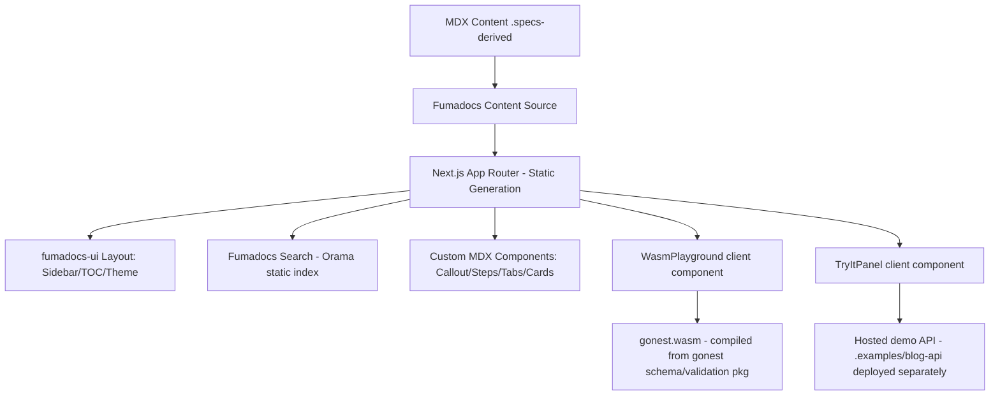

# gonest Documentation Site Design

**Spec**: `.specs/features/docs-site/spec.md`
**Status**: Draft

---

## Architecture Overview

Static-first Next.js (App Router) site using Fumadocs for content/nav/search, MDX for all prose, with two isolated interactive subsystems that don't compromise the static-first model: a client-loaded WASM module (schema/validation logic, no server) and a separately-deployed hosted demo API (real HTTP, called from a "Try it" client component).



---

## Code Reuse Analysis

### Existing Components to Leverage

| Component                                | Location                                         | How to Use                                                                                                                                              |
| ---------------------------------------- | ------------------------------------------------ | ------------------------------------------------------------------------------------------------------------------------------------------------------- |
| gonest README quickstart/examples        | `C:\dev\gonest-dev\gonest\README.md`             | Source of truth for all code snippets — copy verbatim where possible, keep names in sync                                                                |
| gonest `.examples/simple-todo`           | `C:\dev\gonest-dev\gonest\.examples\simple-todo` | Base for simplest live-demo-API deployment target and WASM playground scenarios                                                                         |
| gonest `.examples/blog-api`              | `C:\dev\gonest-dev\gonest\.examples\blog-api`    | Deploy as the hosted demo API for Try-it panels (guards/interceptors/filters/OpenAPI already wired)                                                     |
| gonest core packages (schema/validation) | `C:\dev\gonest-dev\gonest` (module root)         | Import directly in a small `GOOS=js GOARCH=wasm` entrypoint program to build the playground bundle — reuse real validation code, not a reimplementation |
| Content map (this conversation)          | N/A (already extracted)                          | Drives page-by-page content; already verified against README for current vs. spec-era naming                                                            |

### Integration Points

| System                  | Integration Method                                                                                                                                                                                                                                    |
| ----------------------- | ----------------------------------------------------------------------------------------------------------------------------------------------------------------------------------------------------------------------------------------------------- |
| Fumadocs content source | `fumadocs-mdx` reads `content/docs/**/*.mdx`, generates route tree + search index at build time                                                                                                                                                       |
| Fumadocs search         | `fumadocs-core` server + client search API, static Orama index generated at build                                                                                                                                                                     |
| WASM playground         | Go module builds a small `cmd/wasmplayground/main.go` exposing JS-callable functions via `syscall/js`; Next.js loads `.wasm` + `wasm_exec.js` in a client component, lazy-loaded per page                                                             |
| Live demo API           | Separate deploy target (small Go binary running `.examples/blog-api`, e.g. on Fly.io/Render — deployment platform choice deferred to Tasks/Execute phase); docs site calls it via `fetch` from a client component using its public base URL (env var) |

---

## Information Architecture (Sidebar Sections)

1. **Getting Started** — Introduction, Installation, Quickstart, Project Structure (3-phase bootstrap)
2. **Core Concepts** — Modules, Providers & DI Scopes, Controllers & Routes, Dependency Injection (`MustInject`/`MustInjectAll`, multi-binding)
3. **Request Pipeline** — Overview & Execution Order, Middleware, Guards, Interceptors, Filters, Exceptions & Panic Recovery
4. **Validation & Schemas** — Schema Builder Basics, String Family, Numeric & Boolean, Date & Time, Array Builder, Object Builder, Runtime Validation (params/query/body), Custom Validators
5. **Multipart & File Uploads** — Multipart Form Streaming
6. **OpenAPI & Swagger** — Generating OpenAPI docs, Swagger UI setup, Route documentation methods
7. **Event Emitter** — Emitter, Listeners, `MustOn`
8. **Scheduler** — Cron, Interval, Timeout
9. **Health Checks** — Terminus-style readiness/liveness pattern
10. **Testing** — `MustNewTestApp`, `MustOverride`, `MustRequest`, assertions
11. **API Reference** — Generated/curated reference pages per exported symbol, grouped by the sections above

---

## Components

### Site Shell (Fumadocs layout)

- **Purpose**: Root layout wiring theme, sidebar, TOC, search trigger, hero landing page.
- **Location**: `app/layout.tsx`, `app/(home)/page.tsx`, `app/docs/layout.tsx`, `app/docs/[[...slug]]/page.tsx`
- **Interfaces**: Standard Fumadocs `DocsLayout`/`RootProvider` props (nav tree, sidebar tabs, search toggle).
- **Dependencies**: `fumadocs-ui`, `fumadocs-core`, generated `source.ts` from `fumadocs-mdx`.
- **Reuses**: Fumadocs default theme as base; overridden via CSS variables for dark-first polish.

### Theme Layer

- **Purpose**: Dark-first custom theme (colors, fonts, accent) matching better-auth/Hono/Drizzle visual bar.
- **Location**: `app/global.css` (CSS variables per Fumadocs theming docs: `--color-fd-*`)
- **Interfaces**: CSS custom properties consumed by `fumadocs-ui` components; `prefers-color-scheme` + persisted toggle via Fumadocs' built-in theme provider (`next-themes` under the hood).
- **Dependencies**: Fumadocs UI theme API.
- **Reuses**: Fumadocs default light theme kept as the secondary (non-default) theme.

### Custom MDX Components

- **Purpose**: `Callout`, `Steps`, `Tabs`, `Cards` available inside all MDX content.
- **Location**: `mdx-components.tsx` (root component map merging `fumadocs-ui/mdx` defaults with any custom overrides)
- **Interfaces**: MDX tags `<Callout type="info|warn|error">`, `<Steps>`/`<Step>`, `<Tabs>`/`<Tab>`, `<Cards>`/`<Card>`.
- **Dependencies**: `fumadocs-ui/components/callout`, `.../tabs`, `.../card`; `Steps` may need a small custom component if not shipped identically to spec — verify against Fumadocs UI components list during Tasks.
- **Reuses**: Fumadocs ships Callout/Tabs/Cards natively per the components doc — no reimplementation needed, just registration.

### WasmPlayground

- **Purpose**: Client-side interactive schema/validation demo — edit input, run gonest's real validation logic in-browser, see live output.
- **Location**: `components/wasm-playground/` (React client component) + `wasm/cmd/playground/main.go` (Go/WASM entrypoint, lives in the gonest repo or a small vendored copy in this site repo — decide during Tasks based on whether gonest repo accepts a `cmd/` addition)
- **Interfaces**:
  - Go side: `js.Global().Set("gonestValidate", js.FuncOf(func(this, args) any {...}))` exposing a JSON-in/JSON-out validate function per scenario.
  - React side: `<WasmPlayground scenario="user-schema" />` — loads `.wasm` lazily (dynamic import / `useEffect`), renders editable input panel + output panel.
- **Dependencies**: `wasm_exec.js` (from the Go toolchain's `misc/wasm`), a code/JSON editor (lightweight, e.g. CodeMirror) for the input panel.
- **Reuses**: Real gonest schema/validation package — no logic reimplementation, guaranteeing docs never drift from actual behavior.
- **Error handling**: if WASM fails to load/instantiate, component falls back to a static, non-interactive rendering of the same example (satisfies DOCS-04 AC3).

### TryItPanel

- **Purpose**: Send real HTTP requests to the hosted demo API and show real responses, for pipeline/DI/OpenAPI examples that need actual network behavior.
- **Location**: `components/try-it-panel/`
- **Interfaces**: `<TryItPanel method="GET" path="/posts/:id" schema={...} baseUrlEnv="NEXT_PUBLIC_DEMO_API_URL" />`
- **Dependencies**: `fetch` (client-side), demo API's own OpenAPI JSON (optionally fetched to auto-populate example request bodies).
- **Reuses**: gonest's own `SetupSwagger`/OpenAPI output from the hosted demo API — the panel can read `/openapi.json` from the demo API to build its editable request form rather than hand-maintaining schemas twice.
- **Error handling**: unreachable demo API shows an inline error state scoped to the panel; rest of page unaffected (satisfies DOCS-05 AC3).

### Search

- **Purpose**: Instant fuzzy search across all doc content.
- **Location**: Fumadocs built-in (`fumadocs-core/search`), wired via `app/api/search/route.ts` or static export mode per Fumadocs search docs.
- **Interfaces**: Cmd/Ctrl+K modal (Fumadocs default `SearchDialog`).
- **Dependencies**: Orama (bundled with Fumadocs search).
- **Reuses**: Fumadocs default — no custom search implementation needed.

---

## Data Models

### MDX Frontmatter (per doc page)

```typescript
interface DocFrontmatter {
  title: string
  description: string
  icon?: string        // Fumadocs icon name for sidebar
}
```

### Playground Scenario (WASM)

```typescript
interface PlaygroundScenario {
  id: string                 // e.g. "user-schema-required-field"
  defaultInput: string       // JSON seed shown in editor
  wasmFunctionName: string   // JS global function exposed by Go/WASM binary
}
```

**Relationships**: Each `WasmPlayground` MDX embed references one `PlaygroundScenario.id`; the Go/WASM binary must expose a matching `wasmFunctionName`.

---

## Error Handling Strategy

| Error Scenario                                         | Handling                                                                | User Impact                                     |
| ------------------------------------------------------ | ----------------------------------------------------------------------- | ----------------------------------------------- |
| WASM fails to load (old browser, blocked, slow)        | Catch in `useEffect`, set `status: "fallback"`                          | Static code example shown instead, no broken UI |
| Demo API unreachable/5xx                               | `fetch` catch block sets panel error state                              | Inline error banner in that panel only          |
| Search index missing at build (misconfigured content)  | Fumadocs build fails loudly (build-time error)                          | Caught in CI before deploy, never reaches users |
| MDX content references a removed/renamed gonest symbol | Content review step (manual, Tasks phase checklist) cross-checks README | Prevented before publish, not a runtime concern |

---

## Tech Decisions (only non-obvious ones)

| Decision                   | Choice                                                                                                                                                | Rationale                                                                                                                                                                                                    |
| -------------------------- | ----------------------------------------------------------------------------------------------------------------------------------------------------- | ------------------------------------------------------------------------------------------------------------------------------------------------------------------------------------------------------------ |
| Docs framework             | Fumadocs on Next.js App Router                                                                                                                        | Explicitly requested by user; native Callout/Tabs/Cards/search/theming out of the box                                                                                                                        |
| Content format             | MDX files under `content/docs/`, sourced via `fumadocs-mdx`                                                                                           | Explicitly requested; standard Fumadocs content model                                                                                                                                                        |
| Interactive Go execution   | WASM (compiled from real gonest code) for logic-only demos + separately hosted live API for full HTTP/pipeline demos                                  | User-approved hybrid approach (no full arbitrary-code sandbox — out of budget; WASM keeps validation demos accurate and dependency-free; hosted API is the only way to demo real middleware/guard/DI chains) |
| WASM source location       | TBD in Tasks: either a small `cmd/` added to the gonest repo, or a thin vendoring copy inside the site repo importing `gonest` as a module dependency | Depends on whether gonest repo owner wants a WASM entrypoint checked in there vs. kept doc-site-local; default to site-local import of the `gonest` Go module to avoid touching gonest repo unnecessarily    |
| Live demo hosting platform | Deferred to Tasks phase                                                                                                                               | Not yet decided (Fly.io/Render/Railway/etc.) — needs a cost/uptime tradeoff discussion, not a docs architecture concern                                                                                      |
| Theme default              | Dark-first                                                                                                                                            | Explicit reference-site match (better-auth/Hono/Drizzle all dark-first); Fumadocs supports default theme via `next-themes` config                                                                            |
| API Reference generation   | Hand-curated MDX pages per symbol (not auto-generated from Go doc comments) for v1                                                                    | No existing tool reliably generates Fumadocs-compatible MDX from Go godoc; hand-curation also lets us normalize spec-era vs. current naming during authoring                                                 |

---

## Tips Applied

- Content accuracy is the #1 risk (naming drift, spec-era vs. current API) — every page-writing task in Tasks phase must include a README cross-check step.
- WasmPlayground and TryItPanel are isolated, independently-failing components — a failure in either must never break page-level static content (this is a hard requirement, not a nice-to-have, since v1's core value is the reference content itself).
