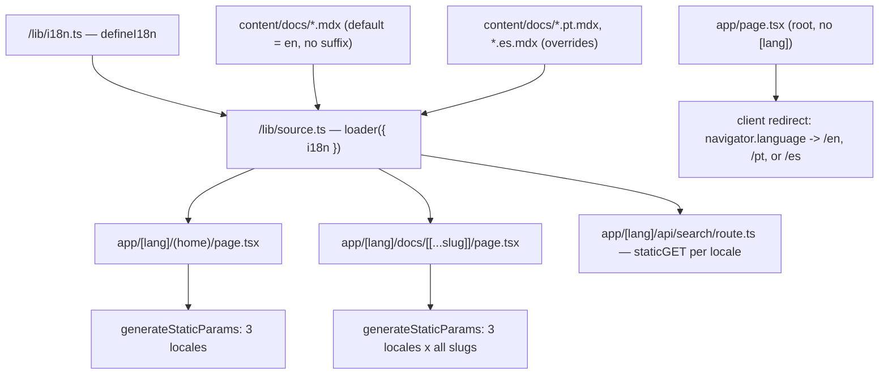

# i18n Design

**Spec**: `.specs/features/i18n/spec.md`
**Context**: `.specs/features/i18n/context.md` (locked decisions — locale prefix strategy, locale codes, v1 translation scope)
**Status**: Draft

---

## Architecture Overview

Fumadocs' native i18n (`fumadocs-core/i18n`) generates one page tree per
locale from the `loader()` call in `src/lib/source.ts`. Routing moves from
`app/(home)` + `app/docs/[[...slug]]` to `app/[lang]/(home)` +
`app/[lang]/docs/[[...slug]]`, with `generateStaticParams` enumerating
`(lang × slug)` combinations. Because `hideLocale: 'never'` is chosen
(context.md Decision 1), **no Next.js Middleware is required or used** —
this is pure static params generation, fully compatible with
`output: 'export'`.



---

## Code Reuse Analysis

### Existing Components to Leverage

| Component | Location | How to Use |
|---|---|---|
| `source.ts` loader | `src/lib/source.ts` | Add `i18n` config to the existing `loader({...})` call — same file, same export shape |
| `staticGET` search pattern | `src/app/api/search/route.ts` (from `docs-site`) | Same `createFromSource(source).staticGET` mechanism now naturally becomes per-locale once `source` is i18n-aware; move the route under `app/[lang]/api/search/` |
| `DocsLayout`/`HomeLayout` + `baseOptions()` | `src/lib/layout.shared.tsx` | Accept a `lang` param and pass Fumadocs' `i18n` prop through so nav chrome strings can localize |
| `Footer`, hero `page.tsx` | `src/components/footer.tsx`, `src/app/(home)/page.tsx` | Move under `app/[lang]/(home)/`; extract hardcoded English strings into a small per-locale dictionary (see Data Models) |
| All 43 existing `content/docs/**/*.mdx` files | `content/docs/` | **Zero renames required** — per Fumadocs' file-suffix convention, the default locale (`en`) needs no suffix at all; only `pt`/`es` overrides get `.pt.mdx`/`.es.mdx` siblings |
| GitHub Pages workflow | `.github/workflows/deploy.yml` (from prior work) | No change needed — `pnpm build` output already becomes `out/`, now just with 3x the static pages |

### Integration Points

| System | Integration Method |
|---|---|
| Fumadocs source loader | `defineI18n({ defaultLanguage: 'en', languages: ['en', 'pt', 'es'], hideLocale: 'never' })` passed into `loader({ i18n, ... })` |
| Root redirect page | New `app/page.tsx` (outside `[lang]`) — client component reading `navigator.language`, mapping to one of the 3 supported codes, `router.replace()`; a plain `<a href="/en/">` link as the no-JS fallback |
| Language switcher | Fumadocs UI ships a built-in locale switcher for `RootProvider`/`DocsLayout` (`i18n` prop) — reuse it rather than hand-building one; verify exact prop name against `fumadocs-ui` during Tasks (Context7/local `node_modules` check) |
| Static search per locale | `source.getPages(locale)` already locale-aware once `i18n` is configured; the existing `staticGET` route pattern needs one instance per `[lang]` segment |
| Translated content | `content/docs/getting-started/*.pt.mdx`, `*.es.mdx` (5 pages × 2 locales = 10 new files); home page strings in a small dictionary consumed by `app/[lang]/(home)/page.tsx` |

---

## Information Architecture (Route Changes)

**Before:**
```
app/(home)/page.tsx          ->  /
app/docs/[[...slug]]/page.tsx ->  /docs/...
app/api/search/route.ts       ->  /api/search
```

**After:**
```
app/page.tsx                          ->  /                (client redirect only)
app/[lang]/(home)/page.tsx            ->  /en/, /pt/, /es/
app/[lang]/docs/[[...slug]]/page.tsx  ->  /en/docs/..., /pt/docs/..., /es/docs/...
app/[lang]/api/search/route.ts        ->  /en/api/search, /pt/api/search, /es/api/search
```

The OG-image, `llms.txt`/`llms-full.txt`/`llms.mdx` routes (from `docs-site`)
move under `app/[lang]/...` the same way, each gaining a `lang` param in
`generateStaticParams` per the Fumadocs i18n migration note
(`source.generateParams('slug', 'locale')` replaces the old
`source.generateParams()` call — confirmed against current Fumadocs docs,
not assumed).

---

## Components

### `lib/i18n.ts` (new)

- **Purpose**: Single source of truth for supported locales.
- **Location**: `src/lib/i18n.ts`
- **Interfaces**: `export const i18n = defineI18n({ defaultLanguage: 'en', languages: ['en', 'pt', 'es'], hideLocale: 'never' })`
- **Dependencies**: `fumadocs-core/i18n`
- **Reuses**: N/A (new foundational file)

### `lib/source.ts` (modified)

- **Purpose**: Make the existing loader locale-aware.
- **Location**: `src/lib/source.ts`
- **Interfaces**: `loader({ baseUrl: docsRoute, source: docs.toFumadocsSource(), i18n, plugins: [...] })`
- **Dependencies**: `src/lib/i18n.ts`
- **Reuses**: Existing loader call — additive change, no new file

### Root redirect page (new)

- **Purpose**: Satisfy i18n-04 — send `/` to a sensible locale without Middleware.
- **Location**: `src/app/page.tsx`
- **Interfaces**: Client component; reads `navigator.language`, maps first matching supported code, else `en`; `<a href="/en/">Continue in English</a>` as visible no-JS fallback (not just a `<noscript>` redirect meta, per FR-i18n-04 AC2 requiring a visible link).
- **Dependencies**: `next/navigation` (`useRouter`) or a plain `<meta http-equiv="refresh">` — decide exact mechanism in Tasks based on what plays best with static export (a static `<meta refresh>` is actually simpler/more robust than client JS for a redirect-only page and needs no hydration; lean toward that unless Tasks research finds a blocker).
- **Reuses**: N/A (new, minimal page)

### `app/[lang]/(home)/page.tsx`, `app/[lang]/docs/[[...slug]]/page.tsx` (moved + modified)

- **Purpose**: Existing home/docs pages, now locale-parameterized.
- **Location**: moved from `app/(home)/page.tsx` and `app/docs/[[...slug]]/page.tsx`
- **Interfaces**: Add `params: { lang: string }` (Next.js App Router convention), pass `lang` into `source.getPage(slug, lang)` / `source.getPageTree(lang)` per Fumadocs i18n API, and into `DocsLayout`/`HomeLayout`'s `i18n` prop for the built-in language switcher.
- **Dependencies**: `src/lib/i18n.ts`, existing `source.ts`
- **Reuses**: All existing layout/theme/component work from `docs-site` — no visual redesign, purely routing + locale plumbing

### Home page string dictionary (new)

- **Purpose**: Localize the hardcoded English strings in the hero (`page.tsx`) and `Footer`.
- **Location**: `src/lib/home-dictionary.ts` (or colocated per-locale objects — exact shape decided in Tasks)
- **Interfaces**: `getHomeDictionary(lang: 'en' | 'pt' | 'es') -> { heroTitle, heroSubtitle, ctaGetStarted, ctaGithub, capabilities: [...], footerLicenseNote, footerCreatedBy }`
- **Dependencies**: None
- **Reuses**: Existing English copy from `docs-site`'s hero as the `en` entry — copy, don't rewrite

---

## Data Models

### `I18nConfig` (from `fumadocs-core/i18n`, consumed not defined by us)

```typescript
interface I18nConfig {
  defaultLanguage: string;   // 'en'
  languages: string[];       // ['en', 'pt', 'es']
  hideLocale: 'never' | 'default-locale' | 'always';
}
```

### Home dictionary entry (new, ours)

```typescript
interface HomeDictionary {
  heroTitle: string;
  heroSubtitle: string;
  heroTagline: string;
  ctaGetStarted: string;
  ctaGithub: string;
  capabilitiesSectionTitle: string;
  capabilities: { title: string; description: string }[]; // same 10 entries, localized title/description
  footerLicenseNote: string;
  footerCreatedBy: string;
}
```

**Relationships**: One `HomeDictionary` per supported locale (3 total),
keyed by locale code, consumed by `app/[lang]/(home)/page.tsx` and
`Footer`.

---

## Error Handling Strategy

| Error Scenario | Handling | User Impact |
|---|---|---|
| Translated `.pt.mdx`/`.es.mdx` file has invalid frontmatter | Fumadocs-mdx build fails loudly at `pnpm build` | Caught in CI before deploy, never reaches users |
| A page has no translation for the requested locale | Fumadocs' built-in fallback-to-default-language | Page renders in English, no error, no 404 |
| Root `/` visited with an unsupported `navigator.language` (e.g. `de-DE`) | Redirect logic's `else` branch | Lands on `/en/`, same as any first-time visitor with no language preference |
| `generateStaticParams` omits a `lang × slug` combination by mistake | Build produces a 404 for that path — caught by the existing `pnpm build` gate before deploy | None if gate is respected; tracked as a Tasks-phase risk to verify explicitly (see Tasks T-level checklist) |

---

## Tech Decisions (only non-obvious ones)

| Decision | Choice | Rationale |
|---|---|---|
| Locale prefix visibility | `hideLocale: 'never'` | Only option compatible with zero-Middleware static export (context.md Decision 1) |
| Locale codes | `en`, `pt`, `es` (no region suffix) | Matches Fumadocs' own convention; register (Brazilian Portuguese, neutral Spanish) is an authoring concern, not a routing one (context.md Decision 2) |
| Root `/` redirect mechanism | Lean toward static `<meta http-equiv="refresh">` over client JS `useRouter` | Needs no hydration, works even if JS is slow/blocked once combined with the visible fallback link; final call deferred to Tasks-phase quick research since it's a small, reversible implementation detail, not an architectural one |
| File renaming for existing English content | **None required** | Fumadocs' file-suffix convention makes the default locale suffix-optional — directly corrects the "rename all 43 files" assumption surfaced by the user's prior (incorrect) research, verified against current Fumadocs docs via Context7 |
| Language switcher UI | Reuse Fumadocs UI's built-in switcher (via `DocsLayout`/`RootProvider`'s `i18n` prop) instead of hand-building one | Less code, matches the "minimal custom UI" principle already applied throughout `docs-site`; exact prop wiring confirmed against installed `fumadocs-ui` version during Tasks, not assumed here |
| Translation scope for v1 | Home + Getting Started only (context.md Decision 3) | Decouples infra correctness (verifiable, bounded) from the open-ended content-translation effort |

---

## Tips Applied

- No Middleware anywhere in this design — every mechanism (`hideLocale: 'never'`, static params, static per-locale search, meta-refresh root redirect) is chosen specifically because it survives `output: 'export'`.
- Zero file renames for existing English content is a direct, verified correction of the flawed premise in the user-supplied research (GEMINI.md) — flagged explicitly rather than silently building on it.
- Reuses are maximized: layout, theme, MDX components, GitHub Pages workflow, and the `staticGET` search pattern from `docs-site` all carry over unchanged in mechanism, only parameterized by locale.
