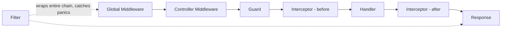

Cada solicitud fluye a través de un orden fijo y comprobado:

- El **Middleware global** (`Module.Use`) siempre se ejecuta antes del **Middleware del
  Controller** (`Controller.Use`).
- Un **Guard** que devuelve `false` hace un cortocircuito con un 403 automático — la
  solicitud nunca llega a un Interceptor o al Handler.
- El **Interceptor** envuelve el Handler al estilo AOP: el código antes de `next(ctx)` se ejecuta
  antes del Handler, el código de después se ejecuta después.
- El **Filter** envuelve **toda** la cadena — captura panics de cualquier lugar
  dentro de ella (Middleware, Guard, Interceptor o Handler), no solo del
  Handler.

## Pruébalo (Try it)

<Callout type="info">
  Un panel interactivo "Try it" contra una API de demostración real de gonest aterrizará aquí una vez que
  la demostración alojada se haya implementado (consulta `.specs/features/docs-site/tasks.md` T47-T49).
</Callout>

## Próximos pasos

<Cards>
  <Card title="Middleware" href="/docs/request-pipeline/middleware" />
  <Card title="Guards" href="/docs/request-pipeline/guards" />
  <Card title="Interceptors" href="/docs/request-pipeline/interceptors" />
  <Card title="Filters & Exceptions" href="/docs/request-pipeline/filters" />
</Cards>
