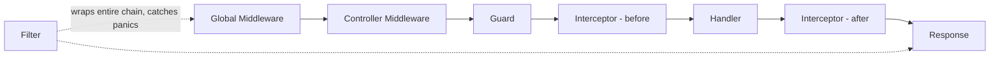

Every request flows through a fixed, proven order:

- **Global Middleware** (`Module.Use`) always runs before **Controller
  Middleware** (`Controller.Use`).
- **Guard** returning `false` short-circuits with an automatic 403 — the
  request never reaches an Interceptor or the Handler.
- **Interceptor** wraps the Handler AOP-style: code before `next(ctx)` runs
  before the Handler, code after runs after.
- **Filter** wraps the **entire** chain — it catches panics from anywhere
  inside it (Middleware, Guard, Interceptor, or Handler), not just the
  Handler.

## Try it

<Callout type="info">
  A live "Try it" panel against a real gonest demo API lands here once the
  hosted demo is deployed (see `.specs/features/docs-site/tasks.md` T47-T49).
</Callout>

## Next steps

<Cards>
  <Card title="Middleware" href="/docs/request-pipeline/middleware" />
  <Card title="Guards" href="/docs/request-pipeline/guards" />
  <Card title="Interceptors" href="/docs/request-pipeline/interceptors" />
  <Card title="Filters & Exceptions" href="/docs/request-pipeline/filters" />
</Cards>
