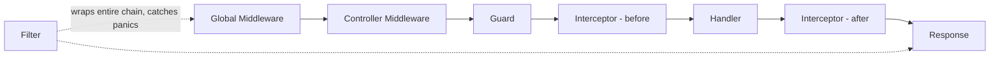

Toda requisição flui por uma ordem fixa e comprovada:

- O **Middleware global** (`Module.Use`) sempre é executado antes do **Middleware de
  Controller** (`Controller.Use`).
- Um **Guard** que retorna `false` faz um curto-circuito (short-circuit) com um 403 automático — a
  requisição nunca alcança um Interceptor ou o Handler.
- O **Interceptor** envolve o Handler no estilo AOP: o código antes de `next(ctx)` roda
  antes do Handler, o código depois roda depois.
- O **Filter** envolve a cadeia **inteira** — ele captura panics de qualquer lugar
  dentro dela (Middleware, Guard, Interceptor ou Handler), não apenas do
  Handler.

## Experimente (Try it)

<Callout type="info">
  Um painel interativo "Try it" rodando em uma API de demonstração do gonest real ficará aqui assim que a
  demo hospedada for implantada (veja `.specs/features/docs-site/tasks.md` T47-T49).
</Callout>

## Próximos passos

<Cards>
  <Card title="Middleware" href="/docs/request-pipeline/middleware" />
  <Card title="Guards" href="/docs/request-pipeline/guards" />
  <Card title="Interceptors" href="/docs/request-pipeline/interceptors" />
  <Card title="Filters & Exceptions" href="/docs/request-pipeline/filters" />
</Cards>
